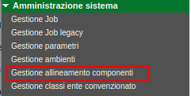

# DIPS: gestione dei permessi

Fonte template redazione documento:  https://www.makeareadme.com/.

# Descrizione

Il progetto ha lo scopo di raccogliere le quattro macro-tipologie di file CSV utilizzati nell'ambito della gestione delle abilitazione dei permessi e azioni visibile dagli utenti sulla base del ruolo ad esso associato nonché dei servizi (REST/SOAP) che essi possono invocare.

Di seguito la lista dei CSV a cui si fa riferimento:

- 1SACER DIPS File azioni pagine.csv: lista delle **azioni** a cui l'operatore viene abilitato all'interno della singola pagina; 
- 2SACER DIPS File entrate menu.csv: voci del **menù** a cui fanno riferimento la macro-funzionalità;
- 3SACER DIPS File pagine web.csv: lista delle **pagine** a cui l'operatore viene abilitato;
- 4SACER DIPS File servizi web.csv: lista dei **servizi** (REST/SOAP) codificati per cui è possibile abilitare un specifico utente.

Una volta effettuata opportunamente la modifica del singolo file CSV, secondo necessità, dovrà essere opportunamente processato attraverso l'applicazione [SIAM](https://github.com/RegioneER/parer-sacer-iam) (SACER Identity and Access Management), l'operazione è possibile solo se **amministratori** per mezzo della funzione "Gestione allineamento componenti" accessibile tra le voci di "Amministrazione sistema".

 

**Nota:** tutti i file CVS (modificato o meno) dovranno essere caricati per mezzo dell'apposita funzionalità definendo da quale versione avranno effetto.

# Installazione

Non esiste alcun processo di installazione, i CSV dovranno essere caricati attraverso piattaforma [SIAM](https://github.com/RegioneER/parer-sacer-iam).

# Utilizzo

Per singolo CSV se ne riportano le caratteristiche per la sua compilazione.

## 1SACER DIPS File azioni pagine.csv

Il file riporta i seguenti attributi / colonne da compilare opportutamente: 

- "APPLIC": nome applicazione, nel caso specifico riportare **DIPS**;
- "NM_PAGINA_WEB": il nome della pagina da abilitare la cui definizione è presente nei sorgenti dell'applicativo DPI, composta da una radice + nome pagina (o su più livelli oltre la radice qualora necessario), dovrà quindi fare "match" con quanto riportato nell'applicativo stesso;
- "NM_AZIONE_PAGINA"; così come per le "coordinate" della pagina, valo la medesima logica sull'azione anch'essa tracciata direttamente nella logica applicativa; 
- "DS_AZIONE_PAGINA" : descrizione dell'azione (label);

### Esempio di configurazione

|||||
|---|---|---|---|
|"APPLIC"|"NM_PAGINA_WEB"|"NM_AZIONE_PAGINA"|"DS_AZIONE_PAGINA"|
|"SACER_DIPS"|"Menu.AmministrazioneSistema"|"Amministrazione Sistema"|2|2|"Menu"|""|

## 2SACER DIPS File entrate menu.csv

Il file riporta i seguenti attributi / colonne da compilare opportutamente: 

- "APPLIC": nome applicazione, nel caso specifico riportare **DIPS**;
- "NMberserk
- _ENTRY_MENU": nome entry del menù da abilitare, tipicamente contraddistinta da una notazione con "." utilizzato come separatore tra i vari "livelli";
- "DS_ENTRY_MENU": descrizione / label della voce abilitata;
- "NI_LIVELLO_ENTRY_MENU": numero del livello della voce all'interno del singolo menù in cui è localizzata;
- "NI_ORD_ENTRY_MENU": ordinamento; 
- "NM_ENTRY_MENU_PADRE": nome dell'entry della voce "padre" ossia colei che contiene quella abilitata su CSV; 
- "DL_LINK_ENTRY_MENU": (opzionale) URL di accesso alla voce abilitata.

### Esempio di configurazione

||||||||
|---|---|---|---|---|---|---|
|"APPLIC"|"NM_ENTRY_MENU"|"DS_ENTRY_MENU"|"NI_LIVELLO_ENTRY_MENU"|"NI_ORD_ENTRY_MENU"|"NM_ENTRY_MENU_PADRE"|"DL_LINK_ENTRY_MENU"|
|"SACER_DIPS"|"/LUM/refertiCollegatiLUM"|"Referti collegati"|"HELP_PAGINA"|"Menu principale - Ricerche - Ricerca referti LUM"|

## 3SACER DIPS File pagine web.csv

Il file riporta i seguenti attributi / colonne da compilare opportutamente: 

- "APPLIC": nome applicazione, nel caso specifico riportare **DIPS**;
- "NM_PAGINA_WEB": voce di menù da abilitare, tipicamente contraddistinta da un percorso a più livelli con separatore "/" in cui viene riportata la "radice" (e.g. "amministrazioneSistema") seguita dalla voce di menù stessa (e.g. configurazioneLogger), ovviamente sia la naming convention che le voci stesse vengono "progettate" e definite all'interno dell'applicazione, con cui le logiche di verificare delle abilitazioni dovranno fare "match";
- "DS_PAGINA_WEB":  descrizione / label della pagina web abilitata;
- "TI_HELP_ON_LINE": tipologia pagina (default : HELP_PAGINA);
- "ENTRY_MENU": nome dell'entry del menù abilitato.

### Esempio di configurazione

||||||
|---|---|---|---|---|
|"APPLIC"|"NM_PAGINA_WEB"|"DS_PAGINA_WEB"|"TI_HELP_ON_LINE"|"ENTRY_MENU"|
|"SACER_DIPS"|"/amministrazioneSistema/gestioneJobRicerca"|"detail/GestioneJobForm#GestioneJobRicercaInfo/totJobDisattiviOperation"|"Filtra totale job disattivi"|

## 4SACER DIPS File servizi web.csv

Il file riporta i seguenti attributi / colonne da compilare opportutamente: 

- "APPLIC": nome applicazione, nel caso specifico riportare **DIPS**;
- "NM_SERVIZIO_WEB": nome del servizio REST/SOAP opportunamente codificato (sulla base di apposiste metodologie/interfacce all'interno dell'applicazione stessa);
- "DS_SERVIZIO_WEB": descrizione del servizio.

### Esempio di configurazione

DIPS, allo stato dell'arte, non utilizza abilitazioni di questo genere non esponendo alcun servizio REST/SOAP.

# Requisiti e librerie utilizzate

Non esistono requisiti o librerie di riferimento.

# Supporto

Mantainer del progetto è [Engineering Ingegneria Informatica S.p.A.](https://www.eng.it/).

# Contributi

Se interessati a contribuire alla crescita del progetto potete scrivere all'indirizzo email <a href="mailto:areasviluppoparer@regione.emilia-romagna.it">areasviluppoparer@regione.emilia-romagna.it</a>.

# Credits

Progetto di proprietà di [Regione Emilia-Romagna](https://www.regione.emilia-romagna.it/) sviluppato a cura di [Engineering Ingegneria Informatica S.p.A.](https://www.eng.it/).

# Licenza

Questo progetto è rilasciato sotto licenza GNU Affero General Public License v3.0 or later ([LICENSE.txt](LICENSE.txt)).
